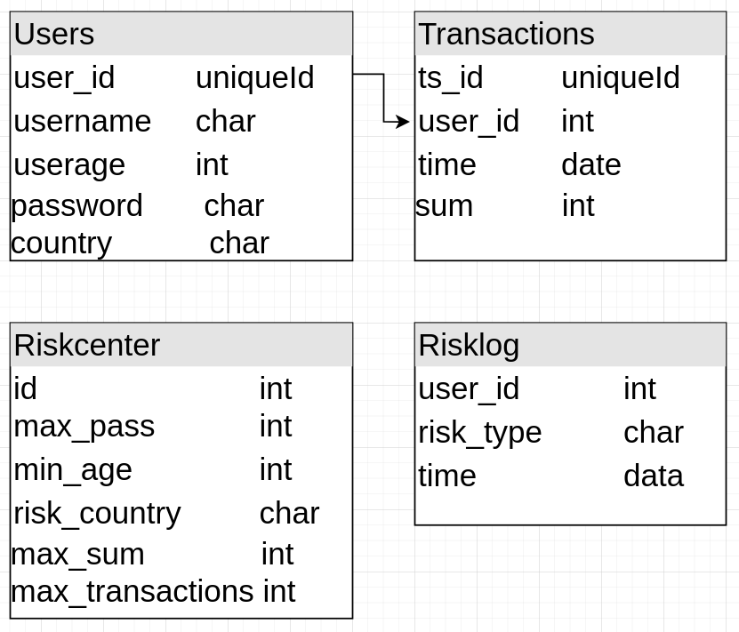

## Тестовое задание

### Risk center

Представим себе, что есть некоторое приложение для финансового сектора, в котором пользователи могут создавать транзакции по переводу денежных средств. К данному приложению необходимо добавить центр управления рисками, который должен работать, исходя из набора определенных правил.

К рискам относятся следующие ситуации:

* Определенное кол-во неуспешных попыток ввода пароля при входе пользователся

* Возраст пользователя меньше определенного

* Страна пользователя попадает в списо стран с повышенным риском

* Сумма транзакции пользователя выше определенной

* Кол-во транзакций в день выше определенного

Риск-центр должен иметь следующий функционал:

* Уметь включать и выключать срабатывание определенного правила с определенными параметрами (например, правило 1 с кол-вом неуспешных попыток 5)

* Если правило сработало, сгенерировать сообщение для администратора и сохранить его в БД

* Возвращать все имеющиеся сообщения с фильтром по типу события

**Пояснение:** для возникновения события не нужно писать систему регистрации и авторизации пользователей, существующие правила должны срабатывать при добавлении транзакции от пользователя, поэтому для тестового задания все необходимые данные пользователя (как то страна, пароль или порядковый номер транзакции за данные сутки) можно включить в параметры транзакции.

**Используемые технологии**

Язык и платформа: typescript и nodejs

База данных (БД): postgreSQL

Метод взаимодействия: REST

## Решение

Создадим клиет-серверную струтктуру проектра, где:

* Папка client содержит фронтенд логику, состоящую из нескольких форм(createUser, createTransaction и changeRiskParameteres) и таблицу сообщений риск-центра. Библиотека запросов - axios.

* Папка server содержит соответственно серверную логику, обрабатывающую запросы и взаимодействующую с postgres.

Структура базы postgres выглядит следующим образом:

